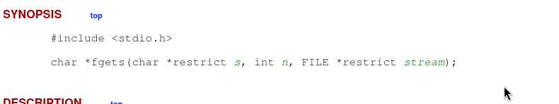
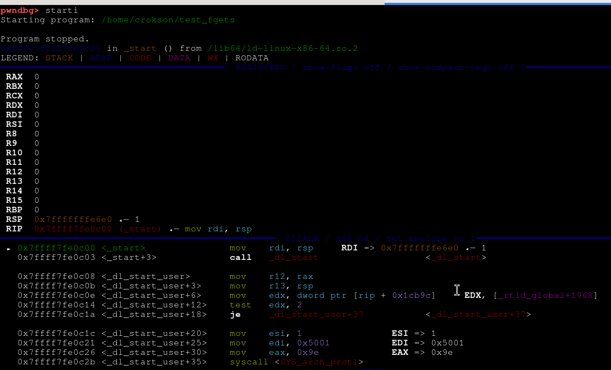
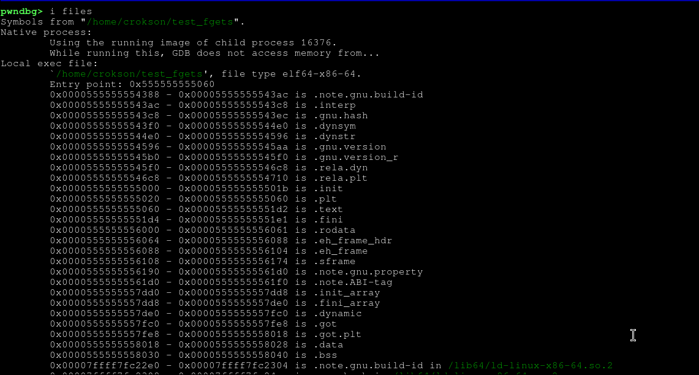
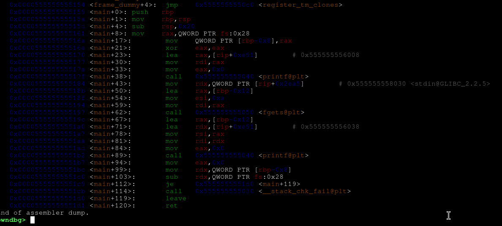
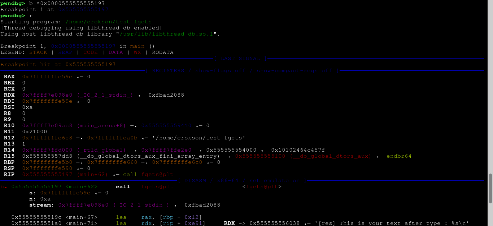
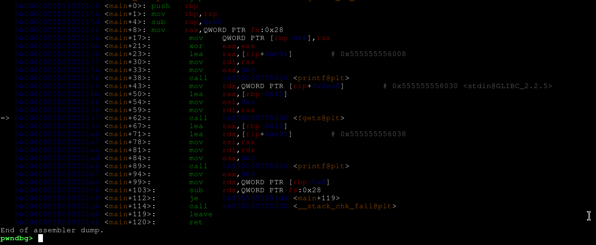
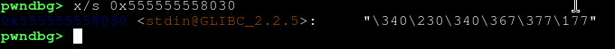
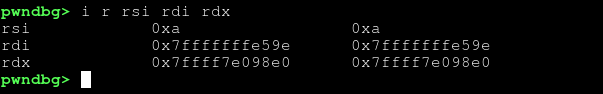
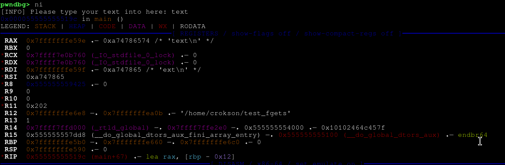
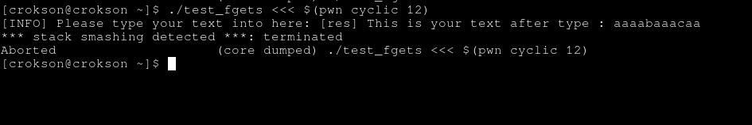

## WriteUp : Understand fgets() in C

Hi guys, welcome to my writeup. Now here, I will introduce function fgets() in C programming

## Index 

- [What's fgets()?](#-what's-fgets)

- [Why fgets() safer read(), scanf()?](#-why-fgets-safer-read-scanf)

- [Debug fgets() on GDB](#-debug-fgets-on-gdb)

## What's fgets()?

- fgets is a function in library `stdio.h`, it reads data from a stream and stores it into a buffer . This is prototype about fgets() :

```
extern char *fgets (char *__restrict __s, int __n, FILE *__restrict __stream)
     __wur __fortified_attr_access (__write_only__, 1, 2) __nonnull ((3));
```

> from library **stdio.h** raw



> from **manpage**

**detail infomation**

- `fget()` return type `char`, get a string `from a stream` mean will have a `buffer` and data will `copy to it` before copying to `buffer dest`.

- **How to fgets() work?** : it will read data or correct better is `byte from stream`, and copy it into `__s` mean `buffer dest`. howerver, fgets can cut short string if it `exceed the limit` of `buffer dest`, all is from `__n` here is a number limit it get a number (ex: `5 byte`) then fget will minus one byte equal 4 byte `5-1=4` , because it for `null byte (\0)` last string for protect program anti `bof vulnerable`

- **for prototype from stdio.h :**

- `__s` : buffer dest
- `__n` : number limit read byte, it will minus one for null byte
- `__stream` : type read (ex : stdin, stdout, sterr)
- `(__write_only__, 1, 2)` : setup write-only from argument 1 and argument 2
- `__nonnull ((3))` : argument 3 `no null` mean argument 3 no leave blank, if leave blank then compiler return error and compile failed

## Why fgets() safer read(), scanf()?

- Because it have mechanism cut `__n - 1` byte, when buffer dest is 100 then it will read 99 byte and null byte from last string, if developer use `sizeof(buffer dest)` transmit into `argument 2 (__n)` then it work. Howerver, if developer dont use sizeof but use number then will bof vulnerable if `number > buffer dest` 

## Debug fgets() on GDB

**the source code C, use fgets :**

```c
#include <stdio.h>

int main(void){
	char buffer[10];
	printf("[INFO] Please type your text into here: ");
	fgets(buffer,sizeof(buffer),stdin); //sizeof buffer = 10 - 1 = 9 because 9 byte for text, 1 byte for null byte

	printf("[res] This is your text after type : %s\n", buffer);

	return 0;
}
```

- We compile it :

> gcc -o test_fgets test_fgets.c

- now we will debug `fgets()` on GDB. before, I need open GDB in terminal linux use command:

> gdb test_fgets

- after enter in gdb environment, we need go to `_start` because need `breakpoint` to `instrution vaddr` fgets. Use command in gdb:

> starti

- It like this :



- continue, we need know what's vaddr ranger of `.text` because `.text` is environment contain all instrution code and CPU find it firstly. Use command:

> i files

- It like this:



- here, `.text` have vaddr ranger is `0x0000555555555060 - 0x00005555555551d2`. Now, we need disassembly it :

> disas 0x0000555555555060 , 0x00005555555551d2

- Or simple can use: 

> disas main 

- If program dont strip symbol. Howerver, I like use `disas .text`

- It like this :



- now, we know target is `0x0000555555555197` from `<main+62>`. We need breakpoint here :

> b *0x0000555555555197

- And try run program in gdb :

> r

- We see like this:



- And This:



- here, we look this code disassembly :

```assembly

  0x0000555555555184 <main+43>:	mov    rdx,QWORD PTR [rip+0x2ea5]        # 0x555555558030 <stdin@GLIBC_2.2.5>
   0x000055555555518b <main+50>:	lea    rax,[rbp-0x12]
   0x000055555555518f <main+54>:	mov    esi,0xa
   0x0000555555555194 <main+59>:	mov    rdi,rax
=> 0x0000555555555197 <main+62>:	call   0x555555555050 <fgets@plt>

```

- ABI rule, then `RDI = argument 1`, `RSI = argument 2`, `RDX = argument 3` . We let start analysis code, vaddr `0x555555558030` transmit to `RDX (argument 3 -> stdin)`:



- And `0xa (covert hexdecimal to decimal is number 10 )` transmit to `rsi (argument 2 -> sizeof(buffer) )` and `rdi (argument 1 -> buffer)` :



- **So what happend when we next instrution ahead?**

> ni

- this is result :



- Here, register rax and rdi is vaddr string `"text"`, howerver register rdi have vaddr is `0x7fffffffe59f <- 0xa747865 /* 'ext\n' */` because computer handle it is `little endianess` reason is in fgets `__n - 1` for null byte, howerver `printf` return output is string intact source like `[res] This is your text after type : text` because :

```assembly

=> 0x0000555555555197 <main+62>:	call   0x555555555050 <fgets@plt>
   0x000055555555519c <main+67>:	lea    rax,[rbp-0x12]
   0x00005555555551a0 <main+71>:	lea    rdx,[rip+0xe91]        # 0x555555556038
   0x00005555555551a7 <main+78>:	mov    rsi,rax
   0x00005555555551aa <main+81>:	mov    rdi,rdx
   0x00005555555551ad <main+84>:	mov    eax,0x0
   0x00005555555551b2 <main+89>:	call   0x555555555040 <printf@plt>

```

- it get string from rax, not from rdi mean before rdi is `ext\n` but now vaddr `0x555555556038 ("[res] This is your text after type : %s\n")` transmit into register rdi 

**case fget() can bof vulnerable**

```c
#include <stdio.h>

int main(void){
        char buffer[10];
        printf("[INFO] Please type your text into here: ");
        fgets(buffer,12,stdin); //danger vulnerable bof : 12 - 1 = 11 > buffer[10]

        printf("[res] This is your text after type : %s\n", buffer);

        return 0;
}
```

- compile it :

> gcc -o test_fgets test_fgets.c

- and test it:

> pwn cyclic 12

- And this, It crash:



- Because from `fgets(buffer,12,stdin);`, number `12 - 1 = 11` and 11 > 10 should crash, and this is buffer overflow vulnerable It very danger 

*WriteUp By : Tran Quang Hao**