# WriteUp : Understand PIE Protector

> WriteUp create date : 08:08 09-05-2026

here, my writeup will introduce the PIE mechanism in Linux


# Index

- [1. What is PIE?](#-1-What-is-PIE?)

- [2. How to PIE work?](#-2-How-to-PIE-work?)

- [3. What happend when without PIE?](#-3-What-happend-when-without-PIE?)

- [4. Debug different program PIE between without PIE](#-4-Debug-different-program-PIE-between-without-PIE)

# 1. What is PIE?

`PIE (Position Indepedent Executable)` is mechanism change the binary for it support `ASLR protector` and `Rip relative`. Because normaly when compiled the binary with gcc, would is binary permancent and when change one the `vaddr (virtual address)` into program then access the trash address, other address worse `SEGFAULT (SIGSEGV)` for accessing vaddr unknown

**Different PIE between ASLR?**

- basically it intimate but PIE for changing the binary support ASLR also about ASLR for randomizing address after it ran or in the process executing

**How to recognize binary PIE and binary without PIE?**

- Can recognize binary PIE and without PIE with `file` or `checksec` command:

> file testing

if output is `pie executable` then it have PIE

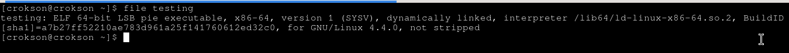

or can use `checksec` :

> checksec file testing

if output is `PIE Enabled` then it have PIE

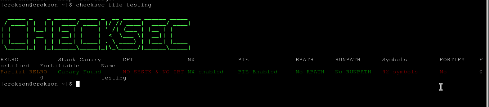

# 2. How to PIE work?

- When program compiled with PIE, It will deformation the binary for :

	supporting ASLR protector : ASLR mechanism protector will randomize address in program, make it diffcult for attacking address caculation if they doesn't `know base vaddr` and `offset`

	relating address in program : instead of use current address, it use `RIP + offset` for accessing current address

	dynamic offsets : it have fixed distance is 4 inches

this help the program with many attack techniques.

# 3. What happend when without PIE?

- when program compiled without PIE, it doesn't ASLR protector, relative address because binary no PIE not support it. After ran the program, base address would load into the memory such as `0x400000` with system architecture 64bit linux, if attacker know exactly base address normally in `.text` , they can address caculation exactly easily. Worse, they can execute attack techniques like `return to libc` or `ROP chains`. Howerver, the binary will evade many attack techniques about PIE like : 

- Partial Overwrites (Byte-Sized Bypass)

- GOT Overwrites & Relocation Attacks

- Relative Offsets in Return-to-vDSO

# 4. Debug different program PIE between without PIE

**We tests and debugs with code C :**

```c
#include <stdio.h>

int main(void){

	int number = 1234;
	char character = 'A';
	char sequences[] = "AAAAAA";

	printf("%d, %p\n%c, %p\n%s, %p\n", // <--- All transmit into it

					number, (void *)&number, //for printing number '%s' and printing address '%p'

					character, (void *)&character, //for printing character '%s' and printing address '%p'

					sequences, (void *)&sequences //for printing sequences '%s' and printing address '%p'
		);
	return 0;
}
```

and compiled with GCC :

**With PIE**

> gcc -o pie PIE.c

it would like:


**With without PIE**

> gcc -o nopie PIE.c -fno-pie -no-pie

it would like:

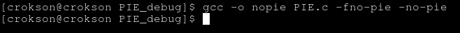

**Why we uses -fno-pie and -no-pie argument?**

- Because static and dynamic files in linux modern default is PIE enable, if we uses -no-pie but not use -fno-pie then error compile like:

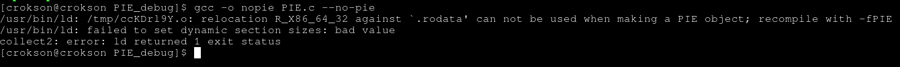

- After compile sucessfully, we uses `checksec` command recognize binary pie and without pie :

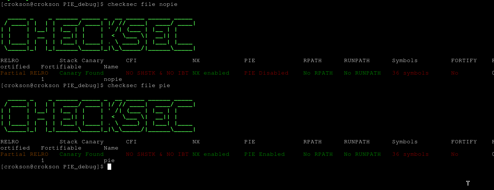

Or can use `file` command if you don't want use `checksec` :

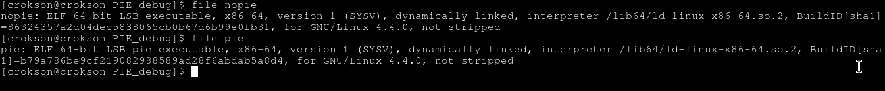

output is `pie executable` with pie, and unknown with `nopie`

# start debug it with GDB

**with PIE program**

> gdb pie

like this:

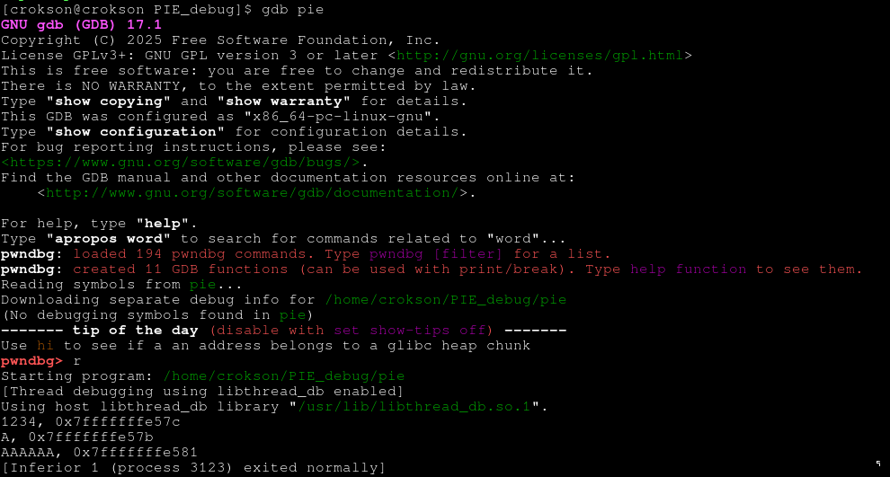

- and now, we uses command disasble ASLR because default enable ASLR in gdb, now we needs off it: 

> set disasble-randomization off

like this:

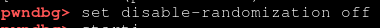

- And now, we shows vaddr in program PIE. Look it would randomized the vaddr, we needs disas it:

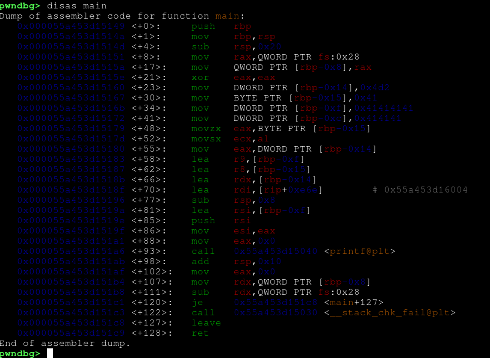

- vaddr such as `0x000055a453d15149` is randomized by ASLR protector. So PIE program supported the ASLR mechanism

**Show Rip-relative in binary PIE**

this here is rip relative:


this:

```asm
  0x000055a4e4eac18f <+70>:	lea    rdi,[rip+0xe6e]        # 0x55a4e4ead004
```

- instead of transmit vaddr current or get from stack, it uses `rip + offset = current vaddr`, here GDB has caculated it is `0x55a4e4ead004` . So pie program supported the Rip relative mechanism

**with without PIE program**

- we uses gdb debug it:

> gdb nopie

like this:

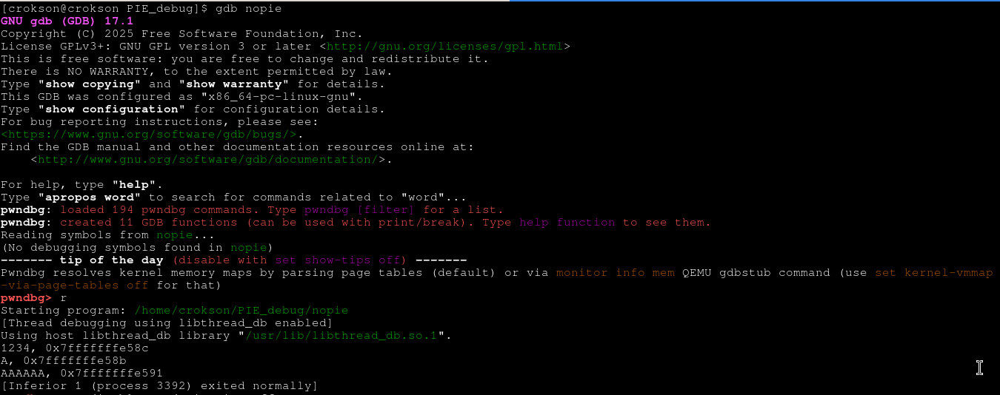

- and now, we wills disable ASLR :

> set disable-randomization off

like this:


- next, we shows vaddr it with disas :

> disas main

like this:

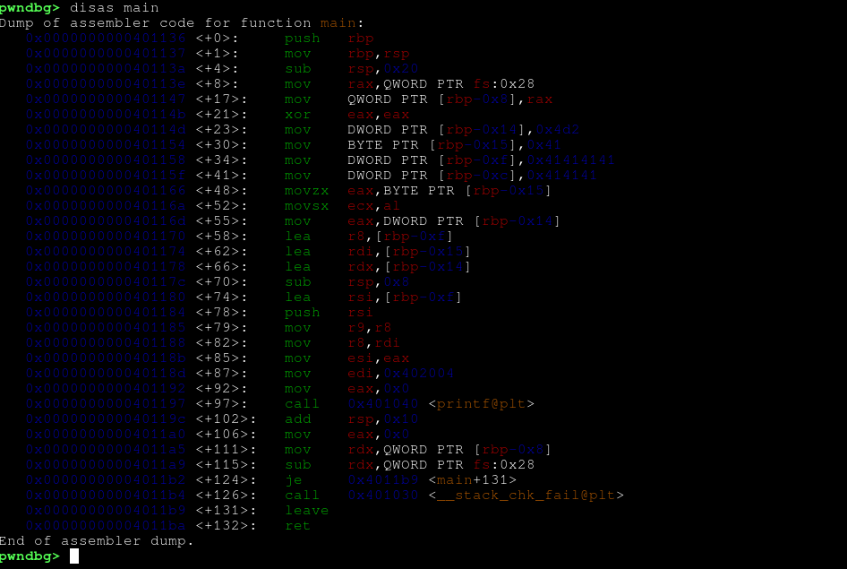

- here, many vaddr such as :

```asm
   0x0000000000401136 <+0>:	push   rbp
   0x0000000000401137 <+1>:	mov    rbp,rsp

   ...
```

- it doesn't randomized the vaddr, so program no pie don't support the ASLR mechanism and rip relative mechanism because in `disassembly` dont look syntax like `[rip + <offset>]`

**WriteUp by : TranQuangHao ( SL.Carnkhra )**
