## Submit task - WriteUp về hàm read linux

**Bản writeup này mình sẽ viết về hàm read linux**

- hàm `read()` là một hàm nằm trong thư viện `unistd.h` một thư viện chính của `linux` dùng để đọc nhận dữ liệu input từ user nhập vào và ghi ra `buffer`. Hàm `read()` có prototype sau:

> Lấy từ file header chính của unistd.h

```bash
extern ssize_t read (int __fd, void *__buf, size_t __nbytes) __wur
    __fortified_attr_access (__write_only__, 2, 3);
```

 **Hoặc từ Manpage**

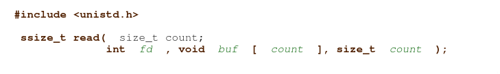

- **Chi tiết** rằng là read trả về kiểu `ssize_t` là một kiểu dữ liệu số nguyên có dấu trong C

	- `N>0` : nếu hàm `read()` trả về số lớn hơn 0, nghĩa là những số đó chính là số byte thực tế đã đọc được

	- `0`: nếu hàm `read()` trả về 0 thì chứng minh rằng quá trình không có bất kỳ vấn đề hay xảy ra lỗi nào. Đúng hơn là cho `EOF(end on file)` nghĩa là nó báo hiệu không còn dữ liệu để đọc
 
	- `-1` : nếu hàm `read()` trả về -1 thì chứng minh chương trình đã xảy ra lỗi và sẽ thiết lập `errno` để chỉ ra lỗi 

- Nếu `nbytes` lớn hơn `ssize_max` (nghĩa là `giới hạn trên một số nguyên có dấu`), thì điều này làm tăng đáng kể tải trọng máy chủ và làm giảm hiệu suất. Tệ hơn nữa, nó sẽ làm các hàm như `read()` thất bại ngay lập tức và trả về lỗi `invail argument`. Mặt khác, một số hệ thống sẽ tự động cắt ngắn dữ liệu đủ tới `ssize_max` để đảm bảo an toàn. Kịch bản tệ nhất là `Tràn Số` , Theo `kiến trúc máy tính` việc tràn số thường xảy ra khi chúng ta `vượt quá ngưỡng bit` mà CPU có thể hỗ trợ ví dụ 64bit ta dùng `2**64` thì sẽ trả `0` và nếu vượt ngưỡng thì có thể xảy ra `số âm`. Điều này có thể xảy ra `lỗi logic nghiêm trọng` và lỗ hổng như `BOF(buffer overflow)`

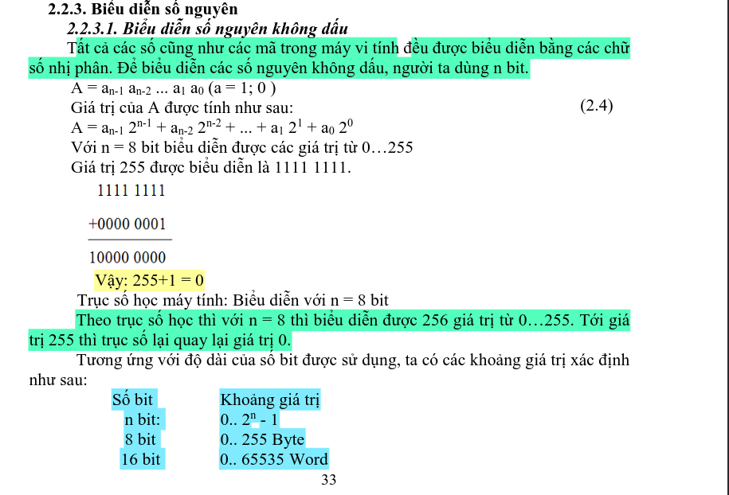

- **vì sao lại gây ra tăng tải trọng và giảm hiệu suất cho hệ thống?** 

	- vì việc `map` các vùng nhớ `lớn hơn mức cho phép` sẽ khiến kernel `làm việc hết sức` để quản lý các `page`, dẫn đến hiện tượng `thrashing(liên tục tráo đổi dữ liệu từ ram và ổ cứng)`

	- CPU sẽ `bị kẹt trong vòng lặp` để xử lý `dữ liệu quá dài`, làm `tăng độ trể` của hệ thống

	- và `tắc nghẽn I/O` , một tiến trình `chiếm dụng băng thông quá lớn` sẽ khiến các `tiến trình khác đói tài nguyên`. Ta ví dụ 1 process dùng `full 100% CPU` thì các process khác bị `đói tài nguyên` và gây nên hiện tượng `giật lag`, nặng hơn là `crash` luôn

- **Thông thường**: các hàm như `read()` đều truyền tải tối đa `0x7ffff000 (2.147.479.552) byte`, trả về `số byte` thực sự đã được chuyển. 

- **Đê khác phục vấn đề này**: chúng ta cần thêm điều kiện kiểm tra `nbyte` và `ssize_max`:

```c
if (nbyte < ssize_max){
	perror("[ERR] nbyte < ssize_max: ");
	return -1;
}
```

- **Trong đó có các argument của read() như sau** :

> đọc từ prototype lấy tại header unistd.h
 
	- `fd` : là type đọc chuẩn của linux, nó đóng vai trò là thiết lập kiểu đọc như ( `0` = stdin, `1` = stdout, `2` = stderr). ở đây, nó không có buffer trung gian. Cứ đọc/ghi gì thì nó sẽ ghi ra luôn, không sợ bị `lưu trong ram` và `mất điện` thì dữ liệu sẽ mất như `stream`, có điều nó không tối ưu hóa lần gọi syscall làm cho CPU `chậm trễ hơn` khi xử lý `dữ liệu dài`

	- `buf` : như cái tên, đây là buffer. Chúng ta có thể gán buffer vào đây để nó ghi các dữ liệu vào trong đó

	- `nbytes` : là số byte cần đọc, ví dụ thiết lập cái này là 1 byte thì nó sẽ đọc đúng 1 byte, còn 3 byte thì đúng 3 byte

	- `(__write_only__, 2, 3)` : nói với compiler rằng hàm sẽ cho phép ghi tại argument `2(buf)`, và `3(nbyte)`. Và chỉ ghi không được đọc 

- Hơn nữa hàm `read()` thường đọc dưới dạng `thô (raw)`, nghĩa là khi gặp `null byte ( \0 )` thay vì dừng lại, thì nó lại đọc tiếp dù có null byte hay không, điều này thường nguy hiểm hơn khi `nbytes` có số lượng vượt quá ngưỡng mà `buffer` cho phép và sẽ gây ra lỗ hổng `Buffer overflow`

## ví dụ minh họa và Debug hàm read()

**Debug khi hàm read() có số nbytes vượt ngưỡng buffer cho phép, gây BOF**

- ví dụ code C:

```c
#include <stdio.h>
#include <unistd.h>

int main(void){
	char buffer[10];

	printf("bạn hãy nhập một chuỗi bất kỳ :\n");
	read(0, buffer, 20); // 0 = stdin, lưu vào buffer, cho phép đọc 20 ký tự (Bug tại đây) 

	return 0;
}
```

- biên dịch nó:

> gcc -o buf_bof_read buf_bof_read.c --no-stack-protector

- Chúng ta bắt đầu chạy nó bằng lệnh :

> ./buf_bof_read 

- Khi chạy, nó sẽ hiện `bạn hãy nhập một chuỗi bất kỳ :\n` và newline xuống dòng :

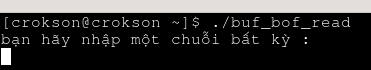

- chứng minh rằng read có cắt đúng 20 ký tự hay ko thì tus vào gdb:

> gdb buf_bof_read

- chúng ta `breakpoint` tại khúc call `read()` tại main:

> disas main

- tìm và `break` tại `instrution` phần `call read`:

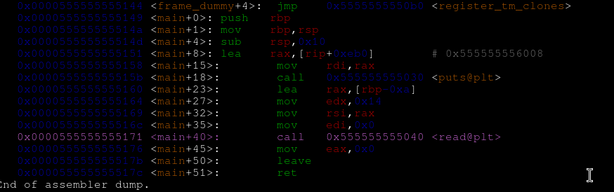

> ở đây ta thấy phần call nằm ở `main + 40`, ở instrution là `0x0000555555555171` chính là vaddr của phần mà ta cần break

- Chúng ta break tại `0x0000555555555171` vì đây là vaddr của hàm call read

> b *0x0000555555555171


- và chúng ta tiến hành nhập 40 chuỗi ngẫu nhiên vào :

> r <<<$(pwn cyclic 40)

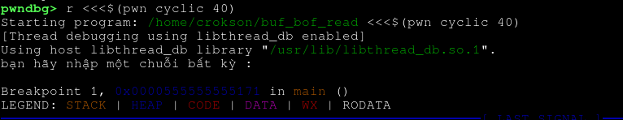

- ta thấy nó bị `break` ngay tại phần `call read`

**Tiến hành phân tích disas để tìm argument**

- ta biết ABI có rule là rdi thuộc `argument 1`, rsi thuộc `argument 2` và rdx thuộc `argument 3` . Vậy ta dùng:

> disas main

- tìm phần `call read`

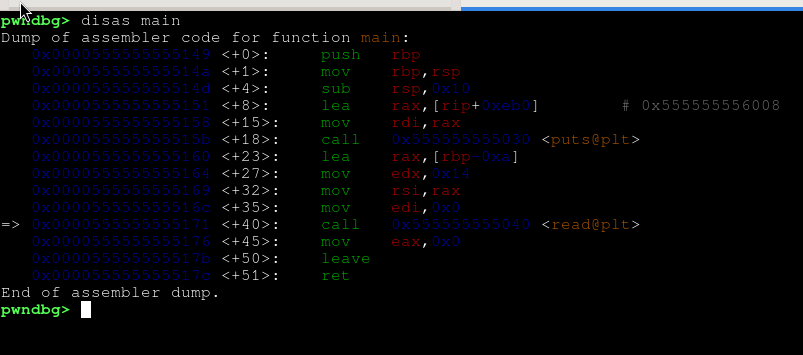

- chú ý dòng này :

```assembly

   0x0000555555555164 <+27>:	mov    edx,0x14
   0x0000555555555169 <+32>:	mov    rsi,rax
   0x000055555555516c <+35>:	mov    edi,0x0
=> 0x0000555555555171 <+40>:	call   0x555555555040 <read@plt>

```

- tiến hành phân tính, edx là rdx thuộc ar3, ở đây ar3 theo prototype read thì là `nbyte` hiện đang chứa `0x14`, rsi là ar2 chứa `vaddr của buffer`, rdi là ar1 chứa 0 nghĩa `fd = stdin`

- vậy chúng ta đã thấy rất rõ bằng chứng là read có tham số, cắt đi và chỉ giữ `20 byte` thôi vì `0x14 = 20` theo decimal. Để rõ hơn ta dùng

> i r rax rdi rdx 

- nó sẽ hiện `info register rax, rdi, rdx `

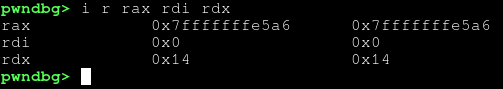

- rõ ràng là `rax = 0x7fffffffe5a6 (địa chỉ buffer) , rdi = 0 (fd = stdin), rdx = 0x14 (nbyte = 20)`

- để biết nó có thật sự là đang hoạt động hay không, ta dùng `ni` để thực thi qua read :

> ni

- để thực thi qua read, ta thấy rõ `rdi` bị ghi đè là qword ngẫu nhiên của `pwn cyclic`:

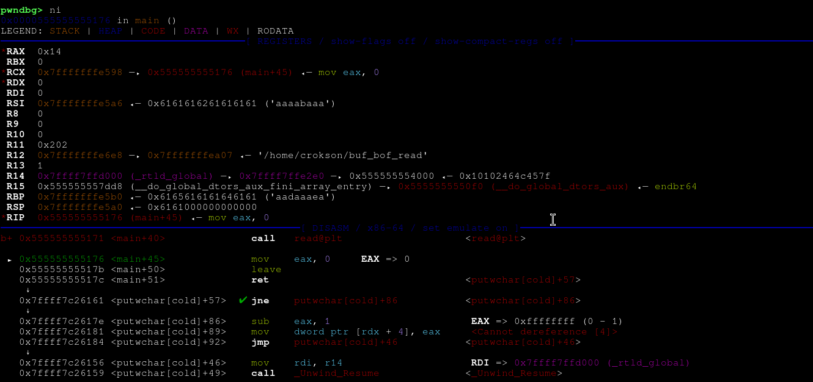

- Và ta show rax :

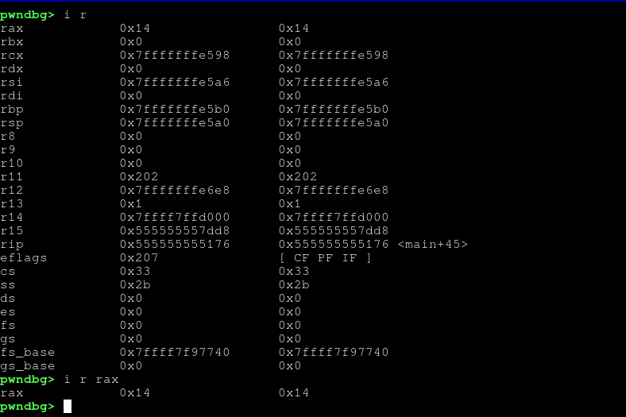

- ta thấy rõ, trước đó rax chứa `vaddr của buffer` giờ là `0x14 là 20 byte`, cho thấy read đã hoạt động cắt `20 byte`

- và khi `r` xóa break đi thì ta thấy program bị BOF, crash . Cho thấy read đã vượt ngưỡng buffer cho phép:

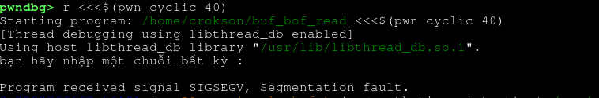

**Debug chứng minh hàm read() có thể đọc luôn null byte**

- để debug phần này, thật đơn giản ta chỉ thêm vào `printf` để chứng minh ở code C thôi :

```c
#include <stdio.h>
#include <unistd.h>

int main(void){
        char buffer[10];

        printf("bạn hãy nhập một chuỗi bất kỳ :\n");
          read(0, buffer, 20); 
        for(int i=0 ; i < 6; i++){
        printf("ký tự : %c, hex : %02x \n",buffer[i],buffer[i]);
}
        return 0;
}

```

- biên dịch

> gcc -o buf_bof_read buf_bof_read.c --no-stack-protector

- và ta tiến hành chạy nó :

> ./buf_bof_read

- khi nó đang ở shell đọc input, ta thử ghi `null byte` vào và đây là kết quả :

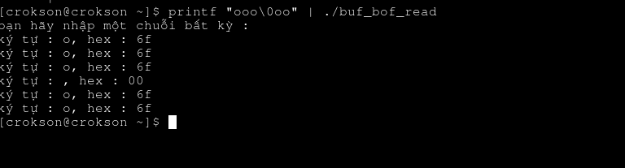

- và nó hoàn toàn đọc và in ra được,

  **Tác giả: Trần Quang Hào**
